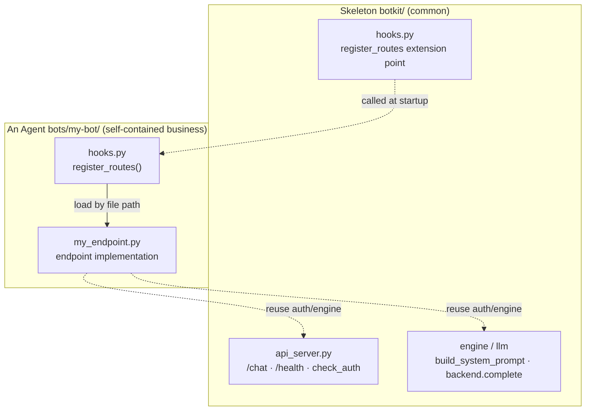

# Configuration Reference

<p align="right"><a href="配置参考.md">中文</a> | <a href="配置参考.en.md">English</a></p>

A full field-by-field reference for `bot.yaml`, for lookup. For building an Agent for the
first time, read the [Guide: Creating a New Agent](新建Bot步骤说明书.en.md) first.

When something is misconfigured, `python -m botkit validate <bot dir>` points out which field.
**A misspelled field name errors out directly**, it is not silently ignored.

---

## Table of contents

- [Overview](#overview)
- [name](#name)
- [wecom — WeCom credentials](#wecom--wecom-credentials)
- [api — external API](#api--external-api)
- [llm — the model](#llm--the-model)
- [prompt](#prompt)
- [mcp — tool sources](#mcp--tool-sources)
- [identity](#identity)
- [session — conversation context](#session--conversation-context)
- [messages — copy](#messages--copy)
- [hooks — code extension points](#hooks--code-extension-points)
- [logging](#logging)
- [Environment variables and .env](#environment-variables-and-env)
- [The framework's processing pipeline](#the-frameworks-processing-pipeline)

---

## Overview

| Field | Required | Default | In one line |
|---|:---:|---|---|
| `name` | yes | — | Agent name, appears in the log prefix |
| `wecom.bot_id` | no* | — | WeCom Agent ID (can be blank for API-only) |
| `wecom.bot_secret` | no* | — | WeCom Agent secret (can be blank for API-only) |
| `api.enabled` | no | `false` | Enable the external chat API (POST /chat) |
| `api.port` | no | `9000` | Port the chat API listens on |
| `api.token` | no | — | Chat API auth token, blank = no auth |
| `llm.client` | no | `openai` | LLM backend, `openai` or `aiohttp` |
| `llm.api_url` | yes | — | LLM endpoint, written differently per backend |
| `llm.api_key` | yes | — | LLM key |
| `llm.model` | yes | — | Model name |
| `llm.timeout_seconds` | no | `60` | Per-request timeout |
| `llm.max_tool_rounds` | no | `6` | Max tool rounds the model may run per turn |
| `prompt.file` | one of | — | Path to the prompt file |
| `prompt.inline` | one of | — | Write the prompt inline |
| `mcp.servers[].name` | yes | — | Server identifier, your choice |
| `mcp.servers[].url` | yes | — | MCP address (Streamable HTTP). On the config page's "Tools" tab, fill the plaintext in each server's "address" box; on save it is written to the local `.env` (variable name derived from the server, e.g. `MCP_URL_MAIN`), and the yaml stores a `${...}` placeholder |
| `mcp.servers[].identity_header` | no | `X-MCP-Identity` | Identity pass-through header, blank = don't send |
| `mcp.servers[].allow_tools` | no | `[]` (all open) | Tool whitelist |
| `mcp.servers[].deny_tools` | no | `[]` | Tool blacklist |
| `identity.source` | no | `wecom_userid` | Identity source |
| `identity.pattern` | no | not validated | Identity format regex |
| `identity.inject` | no | `[]` | Tools and args to force-inject identity into |
| `session.scope` | no | `group_user` | Who shares context with whom |
| `session.max_turns` | no | `10` | How many recent turns to keep |
| `session.ttl_seconds` | no | `1800` | How long until idle context is forgotten |
| `messages.*` | no | see below | Various copy |
| `hooks.file` | no | auto-finds `hooks.py` | Code extension points |
| `logging.level` | no | `INFO` | Log level |

---

## name

```yaml
name: hr-assistant
```

Appears in the prefix of every log line, used to tell Agents apart when several run on the same machine.
Starts with a letter; only letters, digits, underscores, and hyphens are allowed.

---

## wecom — WeCom credentials

```yaml
wecom:
  bot_id: ${WECHAT_BOT_ID}
  bot_secret: ${WECHAT_BOT_SECRET}
```

Get them from the WeCom admin console → Smart Robot → your robot → API mode → long connection.

**Must use `${VAR}` placeholders**, with the real values in a `.env` in the same directory. This way `bot.yaml`
can be safely committed to git and copied between colleagues.

Wrong credentials produce `853000 invalid bot_id or secret` at startup.

> \* **Can be left entirely blank for API-only use**: if this Agent only integrates with Dify / a portal and does not
> connect to a WeCom group, `bot_id` / `bot_secret` can be omitted —— but you must enable the API in the `api` section.
> An Agent must have at least one external surface (WeCom or the chat API), otherwise validation fails.

---

## api — external API

```yaml
api:
  enabled: true
  port: 9000
  token: ${CHAT_API_TOKEN}
```

Exposes the Agent as an HTTP API for Dify, a self-built portal, or any third party.
It can run alongside WeCom, or on its own without WeCom.

| Field | Default | Description |
|---|---|---|
| `enabled` | `false` | When on, the runtime starts an HTTP service |
| `port` | `9000` | Listening port. Use different ports when deploying multiple Agents on one machine |
| `token` | — | Auth token, use a `${VAR}` placeholder with the real value in `.env`. Blank = no auth |

**Ways to start**:

```bash
# WeCom + API at the same time (when api.enabled=true in config)
python -m botkit run bots/your-bot

# API only, no WeCom (Windows: double-click start-api.bat)
python -m botkit serve-api bots/your-bot
```

**API contract**:

```
POST http://<server IP>:<port>/chat
Header:  Authorization: Bearer <token>     # only needed if a token is configured
Body:    {"message": "what the user said", "user": "L220104", "session_id": "conv-1"}
Resp:    {"reply": "Agent reply", "kind": "llm", "session_id": "conv-1"}

GET  http://<server IP>:<port>/health         # liveness check, no auth
```

- **`user`**: provided by the caller (portal / Dify), representing the current user. If the Agent configures
  `identity.pattern`, this value must also match the format (e.g. employee ID `L220104`), otherwise it is rejected by identity validation.
- **`session_id`**: provided by the caller, determines multi-turn context isolation. Consecutive requests with the same `session_id`
  = continuous conversation; a different one = a new conversation; without it, isolation is by `user`.
- The API binds to `0.0.0.0` (reachable on the intranet). It only chats, never reads/writes secrets or disk config,
  a different security trade-off from the "config page" (bound to localhost only).

**Integrating with Dify**: in Dify, use a "custom tool / HTTP request" node pointing at this `/chat`,
passing Dify's current user as `user` and Dify's conversation_id as `session_id`.

### Attaching an Agent's own custom routes (register_routes)

`/chat` is the common conversation entry for all Agents. Some Agents may need extra HTTP endpoints that belong only
to themselves (e.g. structured analysis or bulk import, which don't fit natural-language dialog).
In that case there's no need to change the skeleton: implement a `register_routes` in the Agent's `hooks.py` and
attach your own routes there.

> ⚠️ **This capability requires Python code**. Unlike dialog/tools/copy (which are pure config),
> a custom endpoint's input validation, LLM calls, and output handling are code logic that `bot.yaml` can't express.
> If you'd rather not write code, `/chat` covers the vast majority of conversation scenarios.

### The skeleton vs. business boundary

A custom endpoint is **one Agent's business**, not part of the common skeleton. The skeleton only provides the
`register_routes` mounting point (valuable to all Agents); what endpoints to mount and what they do is entirely up to each
Agent, with the code kept inside that Agent's directory, out of the skeleton.



### Minimal example

```python
# bots/my-bot/hooks.py
def register_routes(app, config, pipeline):
    """Called once when the external service starts, to mount custom routes onto the aiohttp app."""
    from aiohttp import web
    from botkit.api_server import check_auth

    async def handle_echo(request):
        if (resp := check_auth(request, config)) is not None:  # reuse auth
            return resp
        payload = await request.json()
        return web.json_response({"echo": payload})

    app.router.add_post("/echo", handle_echo)
```

Once the Agent starts, `/echo` is mounted on the same port as `/chat` and `/health`.

### The three parameters

| Parameter | What it is | What you can do |
|---|---|---|
| `app` | aiohttp `web.Application` | `app.router.add_post("/xxx", handler)` to mount routes |
| `config` | `BotConfig`, the whole config | read `config.api.token` (auth), `config.name`, etc. |
| `pipeline` | `MessagePipeline` | get `pipeline.engine.backend` (LLM backend), `pipeline.engine.build_system_prompt()` |

### Key points

- It is **not** one of the 5 per-message dialog hooks, but a route-mounting point that runs once at startup,
  with a fixed signature `register_routes(app, config, pipeline)`.
- The framework calls it after assembling `/chat` and `/health`. A mounting error makes startup fail outright
  (no silent downgrade) —— routes are an Agent's core capability, so if they can't come up, that should surface.
- **Reuse the skeleton**: `check_auth(request, config)` uses the same `api.token` as `/chat`;
  when you need the LLM, `pipeline.engine.backend.complete(messages, tools)` is a ready backend,
  and `pipeline.engine.build_system_prompt(identity)` gives you the system prompt assembled from prompt.md + skills.
- **Stateless**: a custom endpoint is usually one-shot; don't reuse `/chat`'s session logic or write to SessionStore;
  just carry all needed fields in each request.
- **Two layers of validation**: one validates input (don't trust the caller), one validates LLM output (don't trust the model),
  mapping to 400 and 500 respectively.
- **Split the code across files**: keep the endpoint implementation in a separate `.py` file in the Agent directory;
  `hooks.py` only loads and mounts it, keeping responsibilities clear. The Agent directory is not a Python package, so
  loading a sibling module by file path with `importlib` is the most reliable (`import xxx` is not reliable).

### Checklist for adding a new endpoint

1. Create `myfeature.py` under `bots/<bot>/`: an input-validation function + handler +
   `register_myfeature_route(app, config, pipeline)`.
2. Implement `register_routes` in `bots/<bot>/hooks.py`, load `myfeature.py` by file path
   and call its registration function.
3. In the handler, use `check_auth` for auth and `engine.backend.complete` to call the LLM, staying stateless.
4. Write tests under `bots/<bot>/tests/` (`pytest.ini`'s `testpaths` already includes `bots`,
   so `python -m pytest` discovers them automatically); integration tests should go through the real
   `load_hooks → create_api_app` mounting chain.
5. Run `python -m botkit validate bots/<bot>` to confirm hooks load fine.
6. Document the endpoint contract in `bots/<bot>/README.md`.

---

## llm — the model

```yaml
llm:
  client: openai
  api_url: ${LLM_API_URL}
  api_key: ${LLM_API_KEY}
  model: ${LLM_MODEL}
  timeout_seconds: 60
  max_tool_rounds: 6
```

### client: how to choose between the two backends

The two backends produce identical results; switching is a one-line change.

| | `openai` (default) | `aiohttp` |
|---|---|---|
| Implementation | official openai SDK | raw HTTP POST |
| Auto-retry | yes | no |
| `api_url` form | up to `/v1` | full endpoint, including `/chat/completions` |
| On a non-standard response | pydantic validation throws, you can't see the raw response | you get the raw JSON and handle it yourself, errors include a snippet of the body |
| Fits | the vast majority of cases | non-standard self-built endpoints or gateways |

**Start with `openai`.** If startup produces a pydantic validation error, or you can't tell from the logs what
the LLM actually returned, switch to `aiohttp` and look again —— it prints the raw response,
which usually pinpoints where the other side is non-standard.

Typical cases `aiohttp` can absorb: responses stuffed with custom fields, a deviated `tool_calls`
structure, errors returned with HTTP 200 (error info in the `error` field),
and a `choices[0].message` missing fields.

### api_url

This is the single most error-prone spot.

```yaml
# client: openai —— up to /v1, the SDK appends /chat/completions itself
api_url: https://xxx.maas.aliyuncs.com/compatible-mode/v1

# client: aiohttp —— the full endpoint
api_url: https://xxx.maas.aliyuncs.com/compatible-mode/v1/chat/completions
```

When the `openai` backend is configured with a full endpoint, `validate` catches it and tells you how to fix it.

### max_tool_rounds

The max number of tool rounds the model may run within one conversation turn. If it hits the limit without
producing a text reply, it returns `messages.tool_rounds_exceeded`.

Raising it doesn't solve the problem —— a model repeatedly calling tools usually means the prompt didn't make
the order clear. First check the logs for which tool it loops on, then rewrite that step in `prompt.md` as
a single numbered rule.

### timeout_seconds

The timeout for a single LLM request. A conversation with tool calls makes multiple requests,
so the total time for one turn may be several times this value.

---

## prompt

```yaml
prompt:
  file: prompt.md
```

Or write it inline (not recommended for long prompts):

```yaml
prompt:
  inline: |
    You are a test Agent.
```

Only one of `file` and `inline` may be set. `file` is resolved **relative to the directory containing `bot.yaml`**,
regardless of which directory you run the command from.

The framework automatically appends the current user's identity to the end of the prompt:

```
# Current user identity
L220104
```

So the prompt doesn't need to teach the model to ask for the employee ID.

---

## mcp — tool sources

```yaml
mcp:
  servers:
    - name: oa
      url: ${MCP_URL}
      identity_header: X-MCP-Identity
      allow_tools:
        - get_system_config
        - create_it_ticket
      deny_tools: []
```

At least one server is required. You can configure several; their tools are merged into one set for the model.

**How to fill the address**: `url` in `bot.yaml` stores a `${...}` placeholder, not the real address.
On the config page's "Tools" tab, fill the plaintext URL in each server's **"address"** box; on save the
framework writes it to the local `.env` in the Agent directory, with the variable name auto-derived from the
server identifier (`main` → `MCP_URL_MAIN`, `crm` → `MCP_URL_CRM`, and so on), and rewrites that server's `url`
in the yaml to the matching placeholder. The `.env` is not in git and does not appear on the "Keys" tab ——
that page only handles WeCom/LLM credentials and no longer lists MCP address variables.

### allow_tools / deny_tools

`allow_tools` **omitted or empty means all open**. `deny_tools` has higher priority,
so even whitelisted tools get excluded by it.

When the platform has many tools, a whitelist is strongly recommended, for two benefits: fewer tools make the
model less likely to pick wrong, and each request carries fewer schemas, saving tokens. A typical example:
the platform has 26 tools, but a ticket-focused Agent needs only 2 of them.

The config page's "Tools" tab lists the tools the server actually provides as checkboxes;
picking from the real list is less error-prone than typing tool names by hand.

If the whitelist names a tool the server doesn't provide (typo, or the platform renamed it),
the startup log emits a WARNING listing it; it doesn't silently fail.

### identity_header

The request-header name used to pass the current user's identity to the MCP server. If the server needs no identity,
leave it blank or delete the line.

This header is one of the bases on which the server decides "no-login" access —— a group chat has no browser login
environment, so the server needs a trusted identity to allow access.

### Multiple servers

```yaml
mcp:
  servers:
    - name: oa
      url: ${MCP_URL}
      allow_tools: [get_system_config, create_it_ticket]
    - name: crm
      url: ${CRM_MCP_URL}
      allow_tools: [get_customer]
```

The framework builds a tool-name-to-server routing table. **On a duplicate tool name, the first one wins**
and a WARNING is logged —— in that case, use `allow_tools` to exclude the duplicate so calls don't land on an
unexpected server.

With multiple servers, one being unreachable doesn't fail the whole turn: it logs an ERROR and continues with the
tools from the remaining servers. Only all of them being unreachable counts as failure.

### Connection behavior

A turn opens one connection and reuses it (no matter how many tool calls, it only handshakes once),
closing it when the turn ends. Connections are not reused across turns —— because the identity header is set at
connect time, reusing would cross user identities.

Connect timeout is 30s, read timeout is 300s (the long read timeout is because the server holds the response
stream open); both are currently hard-coded and not configurable.

---

## identity

```yaml
identity:
  source: wecom_userid
  pattern: "^[LM]\\d{6}$"
  inject:
    - tool: create_it_ticket
      arg: work_code
```

The whole section can be omitted, which means: take the WeCom userid, don't validate the format, don't inject.

### source

| Value | Behavior |
|---|---|
| `wecom_userid` (default) | take `from.userid` from the WeCom message. If the Agent implements a `resolve_identity` hook, the hook's result takes priority |
| `hook` | entirely decided by `resolve_identity` in `hooks.py`. If the hook isn't implemented or returns `None`, resolution failed |

Whether the WeCom userid is a plaintext employee ID depends on how the Agent was created.
When you get an encrypted string (like `wo1234xxx==`), the business system can't recognize it,
so you need `source: hook` to map it. Use `tools/wecom_probe.py` to confirm first.

### pattern

The identity format regex, a safety valve. **On no match it rejects directly**: returns
`messages.identity_invalid`, doesn't enter the LLM, doesn't touch any tool, doesn't write session history.

Omitted means no validation. For example an employee ID like `L220104` / `M220104` maps to
`"^[LM]\\d{6}$"` (backslashes must be doubled in YAML).

Note the two kinds of failure:

- **Resolution failure** (`resolve_identity` returns `None`) → unconditional rejection, unrelated to `pattern`
- **Format mismatch** → only judged when `pattern` is configured

### inject: why it's a must

The LLM makes up arguments on its own. If a tool has a "who is acting" argument (a ticket's
`work_code`, an expense's applicant, a leave's employee ID), the model can very well fill in someone else's ——
a casual "file a fault report for Zhang San" from the user is enough to make it do so.

`inject` lets the framework overwrite the model's value with the trusted identity obtained on the WeCom side
before the call is actually made:

```yaml
identity:
  inject:
    - tool: create_it_ticket
      arg: work_code
    - tool: submit_expense      # multiple entries allowed
      arg: applicant_code
```

The overwrite logs a WARNING and **syncs the change back into the context fed to the model** ——
so the model won't answer the user based on its own rejected record (e.g. "created a ticket for L999999").

**Every "act on someone's behalf" tool should be configured.** This is a code-level guarantee,
not dependent on writing "don't fabricate employee IDs" in the prompt —— prompts can be bypassed.

Execution order: `identity.inject` → `before_tool_call` hook → the actual call.
So the hook can see the injected identity and can also override it.

---

## session — conversation context

```yaml
session:
  scope: group_user
  max_turns: 10
  ttl_seconds: 1800
```

Context lives in process memory, lost on restart. Enough for a WeCom Agent —— context is inherently short-lived.

### scope

| Value | In a group | In a 1:1 | Fits |
|---|---|---|---|
| `group_user` (default) | isolated by "group + person" | by person | most cases. Two people in the same group don't interfere |
| `group` | the whole group shares one | by person | collaborative, several people discussing one thing with the Agent |
| `user` | by person (shared across groups) | by person | needs cross-group memory |

When `chatid` isn't available in a group, it degrades to per-person isolation —— at worst you lose the group
dimension, you won't mix conversations from different groups.

### max_turns

How many recent turns to keep (1 turn = 1 user message + 1 reply). Beyond that, the oldest is dropped.

Raising it has a token cost to watch: every turn sends the full history to the model.

### ttl_seconds

How long until an idle session is forgotten. It's also the memory-reclamation mechanism.

---

## messages — copy

Overridden one by one; anything you don't set uses the default.

| Field | Default | When it's sent |
|---|---|---|
| `welcome` | Hi, @ me and describe your problem, I'll help. | user enters the conversation (`enter_chat` event) |
| `empty_input` | Please describe your problem. | only @'d the Agent without saying anything |
| `thinking` | Processing, please wait... | a line sent first when processing begins |
| `reset_done` | Conversation cleared, let's start over. | a reset keyword matched |
| `error` | Sorry, an error occurred while processing; please check the Agent logs. | LLM/MCP error or unexpected exception |
| `identity_invalid` | Can't recognize your employee ID; please contact the admin to check the WeCom account config. | identity resolution failed or format mismatch |
| `tool_rounds_exceeded` | Processing timed out (too many tool rounds); please describe the problem more specifically and try again. | hit `max_tool_rounds` |

### reset_keywords

```yaml
messages:
  reset_keywords: [restart, start over, clear conversation, reset]
```

Defaults to these. **The whole message must exactly equal** a keyword to match ——
"reset my password" won't be misjudged as a reset command.

Reset has higher priority than the `on_message` hook, so the user can always clear the conversation.

### tool_progress

Progress hints pushed to the user before a tool call, matched by tool name, falling back to `default`.

```yaml
messages:
  tool_progress:
    get_system_config: "Matching system config..."
    create_it_ticket: "Creating a ticket..."
    default: "Calling a tool..."
```

When a tool is slow, a hint makes a big difference to the experience. If `default` isn't set, the framework adds one.

---

## hooks — code extension points

```yaml
hooks:
  file: hooks.py
```

When the whole section is omitted, the framework auto-finds `hooks.py` in the Agent directory; not finding one means no hooks.
Explicitly configured but missing only logs a WARNING (skipped by convention), it doesn't crash.

Most Agents don't need to write code. When needed, implement any of the functions below;
**both sync and `async def` are supported, and anything undefined uses the framework default**.

| Hook | Signature | When to use |
|---|---|---|
| `resolve_identity` | `(frame) -> str \| None` | the WeCom userid isn't a business employee ID and needs a lookup mapping |
| `on_message` | `(text, ctx) -> str \| None` | help menu, fixed Q&A, sensitive-word interception. Returning text skips the LLM |
| `before_tool_call` | `(tool_name, args, ctx) -> dict` | fill defaults, unit conversion, field renaming |
| `after_tool_call` | `(tool_name, result, ctx) -> str` | trim overly long results, redact, reformat |
| `before_reply` | `(text, ctx) -> str` | unified signature, append a help entry |

`ctx` carries `identity`, `session_key`, `config`, `logger`, `frame`.

```python
# hooks.py
def on_message(text, ctx):
    """Help menu answers directly, skips the LLM, saves tokens and responds fast"""
    if text.strip() in ("help", "?"):
        return "I can help you:\n1. create a ticket\n2. check progress"
    return None


def resolve_identity(frame):
    """WeCom gives an encrypted userid; look it up to an OA employee ID"""
    userid = frame.get("body", {}).get("from", {}).get("userid", "")
    return USERID_TO_WORKCODE.get(userid)   # returns None on miss, the framework rejects the request
```

A few conventions:

- **A hook raising an exception won't crash the Agent**: the framework logs an ERROR (with full stack trace) and
  falls back to default behavior. So you don't need a pile of try/except in hooks.
- **A wrong return type also falls back**, likewise logged.
- **A misspelled hook name gets a WARNING**, it won't silently fail.
- **A syntax error or import failure in `hooks.py` errors out directly**, it's not skipped ——
  a file sitting right there but silently not taking effect is harder to debug.
- Each Agent's `hooks.py` is independent; same-named files don't pollute each other.

---

## logging

```yaml
logging:
  level: INFO
```

One of `DEBUG` / `INFO` / `WARNING` / `ERROR` / `CRITICAL` (case-insensitive).

At non-`DEBUG` levels, the framework suppresses third-party library noise (the per-request log line from
httpx2, openai, aiohttp) down to WARNING. Set `DEBUG` to see the details of each LLM request and MCP call.

The log format carries the Agent-name prefix:

```
2026-09-17 13:19:42 [hr-assistant] INFO    [botkit.runtime] Starting Agent hr-assistant
```

---

## Environment variables and .env

Every `${VAR}` in `bot.yaml` is replaced with the environment variable's value. Missing variables are
**all reported at once**, pointing out which field references them:

```
bot.yaml has placeholders without matching environment variables:
  - wecom.bot_id references undefined environment variable ${WECHAT_BOT_ID}
  - llm.api_key references undefined environment variable ${LLM_API_KEY}
```

Source and priority of variables:

1. **Process environment variables** (higher priority)
2. The `.env` file in the Agent directory

Process environment variables take priority so containers/CI can inject secrets directly without changing files.
The side effect: if you've `set`/`export`'d a same-named variable in your shell, it overrides the value in `.env`.
In that case the framework logs a WARNING naming which variables:

```
these variables in xxx/.env are overridden by existing process environment variables, using the environment's values: LLM_API_KEY
```

When a `.env` change doesn't take effect, check this log line first.

`.env` is already in `.gitignore`, so it won't be committed.

---

## The framework's processing pipeline

Understand at which step each config takes effect:

```
A WeCom message comes in
  1. strip the leading @Agent (emails and @colleague in the body are kept)
  2. resolve identity: hooks.resolve_identity or the WeCom userid
  3. resolution failed → return identity_invalid, end
  4. identity.pattern fails → return identity_invalid, end
  5. message is empty → return empty_input, end
  6. matched messages.reset_keywords → clear history, return reset_done, end
  7. hooks.on_message returned text → return it directly, end (skip the LLM)
  8. send a messages.thinking line
  9. fetch this session's history (isolated by session.scope)
 10. fetch whitelisted tools from mcp.servers
 11. LLM loop, up to llm.max_tool_rounds rounds:
       model wants to call a tool →
         identity.inject overrides identity args (logs WARNING)
         hooks.before_tool_call rewrites args
         push the matching messages.tool_progress copy
         call the tool (connection reused within a turn)
         hooks.after_tool_call processes the result
         feed the result back, continue to the next round
       model produces text → break out
 12. rounds exhausted → return tool_rounds_exceeded
 13. hooks.before_reply processes the reply
 14. send it (streaming) + store in session history
```

The replies in steps 3–7 and step 12 **are not written to session history** ——
fixed copy and errors in context would only pollute the following conversation.

An exception at any step returns `messages.error`; the Agent won't freeze up.
