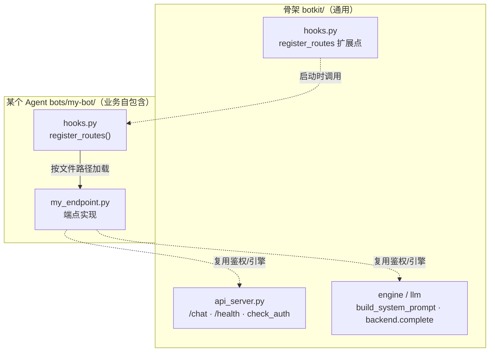

# 配置参考

<p align="right"><a href="配置参考.md">中文</a> | <a href="configuration-reference.md">English</a></p>

`bot.yaml` 全字段说明，查阅用。第一次建 Agent 请先看
[新建 Agent 步骤说明书](新建Bot步骤说明书.md)。

配置写错时 `python -m botkit validate <bot目录>` 会指出是哪个字段。
**写错的字段名会直接报错**，不会被静默忽略。

---

## 目录

- [总览](#总览)
- [name](#name)
- [wecom 企微凭证](#wecom-企微凭证)
- [api 对外接口](#api-对外接口)
- [llm 大模型](#llm-大模型)
- [prompt 提示词](#prompt-提示词)
- [mcp 工具来源](#mcp-工具来源)
- [identity 身份](#identity-身份)
- [session 会话上下文](#session-会话上下文)
- [messages 文案](#messages-文案)
- [hooks 代码扩展点](#hooks-代码扩展点)
- [logging 日志](#logging-日志)
- [环境变量与 .env](#环境变量与-env)
- [框架的处理流程](#框架的处理流程)

---

## 总览

| 字段 | 必填 | 默认值 | 一句话 |
|---|:---:|---|---|
| `name` | 是 | — | Agent 名字，出现在日志前缀 |
| `wecom.bot_id` | 否* | — | 企微 Agent ID（只做对外接口时可留空） |
| `wecom.bot_secret` | 否* | — | 企微 Agent 密钥（只做对外接口时可留空） |
| `api.enabled` | 否 | `false` | 开启对外 chat 接口（POST /chat） |
| `api.port` | 否 | `9000` | chat 接口监听端口 |
| `api.token` | 否 | — | chat 接口鉴权 token，留空=不鉴权 |
| `llm.client` | 否 | `openai` | LLM 后端，`openai` 或 `aiohttp` |
| `llm.api_url` | 是 | — | LLM 端点，两个后端写法不同 |
| `llm.api_key` | 是 | — | LLM 密钥 |
| `llm.model` | 是 | — | 模型名 |
| `llm.timeout_seconds` | 否 | `60` | 单次请求超时 |
| `llm.max_tool_rounds` | 否 | `6` | 一轮对话最多让模型调几轮工具 |
| `prompt.file` | 二选一 | — | 提示词文件路径 |
| `prompt.inline` | 二选一 | — | 直接写提示词 |
| `mcp.servers[].name` | 是 | — | 服务端标识，自取 |
| `mcp.servers[].url` | 是 | — | MCP 地址（Streamable HTTP）。在配置页「工具」页每个服务端的「地址」框直接填明文，保存时会落到本地 `.env`（变量名按服务端生成，如 `MCP_URL_MAIN`），yaml 里存 `${...}` 占位符 |
| `mcp.servers[].identity_header` | 否 | `X-MCP-Identity` | 身份透传头，留空则不发 |
| `mcp.servers[].allow_tools` | 否 | `[]`（全放开） | 工具白名单 |
| `mcp.servers[].deny_tools` | 否 | `[]` | 工具黑名单 |
| `identity.source` | 否 | `wecom_userid` | 身份来源 |
| `identity.pattern` | 否 | 不校验 | 身份格式正则 |
| `identity.inject` | 否 | `[]` | 强制注入身份的工具与参数 |
| `session.scope` | 否 | `group_user` | 谁跟谁共享上下文 |
| `session.max_turns` | 否 | `10` | 保留最近几轮 |
| `session.ttl_seconds` | 否 | `1800` | 空闲多久忘掉 |
| `messages.*` | 否 | 见下 | 各种文案 |
| `hooks.file` | 否 | 自动找 `hooks.py` | 代码扩展点 |
| `logging.level` | 否 | `INFO` | 日志级别 |

---

## name

```yaml
name: hr-assistant
```

会出现在日志每一行的前缀里，多个 Agent 跑在同一台机器上时靠它区分。
字母开头，只能用字母、数字、下划线、连字符。

---

## wecom 企微凭证

```yaml
wecom:
  bot_id: ${WECHAT_BOT_ID}
  bot_secret: ${WECHAT_BOT_SECRET}
```

从企微管理后台 → 智能机器人 → 你的机器人 → API模式 → 长连接 获取。

**必须用 `${VAR}` 占位**，真实值放同目录 `.env`。这样 `bot.yaml`
可以安全提交 git，同事之间直接抄。

凭证不对启动时会报 `853000 invalid bot_id or secret`。

> \* **只做对外接口时可整段留空**：如果这个 Agent 只对接 Dify / 门户、不连
> 企业微信群，`bot_id` / `bot_secret` 不填也行 —— 但要在 `api` 段开启接口。
> 一个 Agent 至少要有一种对外方式（连企微 或 开 chat 接口），否则校验不过。

---

## api 对外接口

```yaml
api:
  enabled: true
  port: 9000
  token: ${CHAT_API_TOKEN}
```

把Agent开成一个 HTTP 接口，供 Dify、自研门户或任何第三方调用。
和企业微信可以同时用，也可以只开接口、不连企微。

| 字段 | 默认 | 说明 |
|---|---|---|
| `enabled` | `false` | 开启后运行时会起一个 HTTP 服务 |
| `port` | `9000` | 监听端口。多个 Agent 同机部署时各用不同端口 |
| `token` | — | 鉴权 token，用 `${VAR}` 占位、真实值放 `.env`。留空 = 不鉴权 |

**启动方式**：

```bash
# 连企微 + 同时起接口（配置里 api.enabled=true 时）
python -m botkit run bots/你的bot

# 只起接口、不连企微（Windows 可双击 start-api.bat）
python -m botkit serve-api bots/你的bot
```

**接口契约**：

```
POST http://<服务器IP>:<port>/chat
Header:  Authorization: Bearer <token>     # 配了 token 才需要
Body:    {"message": "用户说的话", "user": "L220104", "session_id": "conv-1"}
Resp:    {"reply": "Agent回复", "kind": "llm", "session_id": "conv-1"}

GET  http://<服务器IP>:<port>/health         # 探活，免鉴权
```

- **`user`**：由调用方（门户 / Dify）提供，代表当前用户。若 Agent 配了
  `identity.pattern`，这个值也要符合格式（如工号 `L220104`），否则会被身份校验拦下。
- **`session_id`**：由调用方提供，决定多轮上下文的隔离。同一个 `session_id`
  连续请求 = 连续对话；换一个 = 新对话；不传则按 `user` 隔离。
- 接口绑 `0.0.0.0`（内网可达）。它只对话、不读写密钥或磁盘配置，
  和「配置页面」（只绑本机）的安全取舍不同。

**对接 Dify**：在 Dify 里用「自定义工具 / HTTP 请求」节点，指向这个 `/chat`，
把 Dify 的当前用户传给 `user`、把 Dify 对话的 conversation_id 传给 `session_id`。

### 挂 Agent 自己的自定义路由（register_routes）

`/chat` 是所有 Agent 通用的对话入口。个别 Agent 可能需要额外的、只属于自己的
HTTP 端点（比如结构化分析、批量导入这类不适合走自然语言对话的接口）。
这时不用改骨架，在 Agent 的 `hooks.py` 里实现一个 `register_routes`，把自己的
路由挂上去即可。

> ⚠️ **这项能力需要写 Python 代码**。和对话/工具/文案不同（那些纯配置就能改），
> 自定义端点的入参校验、调 LLM、输出处理都是代码逻辑，`bot.yaml` 表达不了。
> 不想写代码的话，`/chat` 足以覆盖绝大多数对话场景。

### 骨架 vs 业务的边界

自定义端点是**某个 Agent 的业务**，不属于通用骨架。骨架只提供 `register_routes`
这个挂载点（对所有 Agent 都有价值），具体挂什么端点、端点里做什么，全由各 Agent 自己
决定，代码留在该 Agent 目录内，不进骨架。



### 最小示例

```python
# bots/my-bot/hooks.py
def register_routes(app, config, pipeline):
    """对外服务启动时调用一次，往 aiohttp app 挂自定义路由。"""
    from aiohttp import web
    from botkit.api_server import check_auth

    async def handle_echo(request):
        if (resp := check_auth(request, config)) is not None:  # 复用鉴权
            return resp
        payload = await request.json()
        return web.json_response({"echo": payload})

    app.router.add_post("/echo", handle_echo)
```

启动 Agent 后，`/echo` 就和 `/chat`、`/health` 挂在同一个端口上。

### 三个入参

| 参数 | 是什么 | 能做什么 |
|---|---|---|
| `app` | aiohttp `web.Application` | `app.router.add_post("/xxx", handler)` 挂路由 |
| `config` | `BotConfig`，整份配置 | 读 `config.api.token`（鉴权）、`config.name` 等 |
| `pipeline` | `MessagePipeline` | 拿 `pipeline.engine.backend`（LLM 后端）、`pipeline.engine.build_system_prompt()` |

### 要点

- 它**不是**那 5 个逐消息调用的对话 hook，而是启动时跑一次的路由挂载点，
  签名固定为 `register_routes(app, config, pipeline)`。
- 框架在组装完 `/chat`、`/health` 之后调用它。挂载出错会让服务启动直接
  失败（不静默降级）——路由是 Agent 的核心能力，起不来就该暴露出来。
- **复用骨架**：`check_auth(request, config)` 和 `/chat` 同一个 `api.token`；
  需要调 LLM 时，`pipeline.engine.backend.complete(messages, tools)` 是现成后端，
  `pipeline.engine.build_system_prompt(identity)` 能拿到 prompt.md + skill 拼好的
  系统提示词。
- **无状态**：自定义端点通常一次一评，别复用 `/chat` 的 session 逻辑、不写
  SessionStore；每次请求带齐所需字段即可。
- **两道校验**：一道校验入参（信不过调用方），一道校验 LLM 输出（信不过模型），
  分别对应 400 和 500。
- **代码分文件**：端点实现建议单独放在 Agent 目录下的 `.py` 文件里，`hooks.py` 只
  负责把它加载并挂上，保持职责清晰。Agent 目录不是 Python 包，`hooks.py` 用
  `importlib` 按文件路径加载同级模块最稳妥（`import xxx` 不可靠）。

### 加一个新端点的 Checklist

1. 在 `bots/<bot>/` 下新建 `myfeature.py`：入参校验函数 + handler +
   `register_myfeature_route(app, config, pipeline)`。
2. 在 `bots/<bot>/hooks.py` 实现 `register_routes`，按文件路径加载 `myfeature.py`
   并调它的注册函数。
3. handler 里用 `check_auth` 鉴权、`engine.backend.complete` 调 LLM，保持无状态。
4. 在 `bots/<bot>/tests/` 写测试（`pytest.ini` 的 `testpaths` 已含 `bots`，
   `python -m pytest` 会自动发现）；集成测试建议走
   `load_hooks → create_api_app` 的真实挂载链路。
5. `python -m botkit validate bots/<bot>` 确认 hooks 能正常加载。
6. 端点契约写进 `bots/<bot>/README.md`。

---

## llm 大模型

```yaml
llm:
  client: openai
  api_url: ${LLM_API_URL}
  api_key: ${LLM_API_KEY}
  model: ${LLM_MODEL}
  timeout_seconds: 60
  max_tool_rounds: 6
```

### client：两个后端怎么选

两个后端产出完全一致，改一行就能切换。

| | `openai`（默认） | `aiohttp` |
|---|---|---|
| 实现 | openai 官方 SDK | 裸 HTTP POST |
| 自动重试 | 有 | 无 |
| `api_url` 写法 | 到 `/v1` 为止 | 完整端点，含 `/chat/completions` |
| 响应不规范时 | pydantic 校验直接抛错，拿不到原始响应 | 拿到原始 JSON 自己兜，报错带响应体片段 |
| 适用 | 绝大多数情况 | 不太规范的自建端点或网关 |

**先用 `openai`。** 如果启动后报的是 pydantic 校验错误，或者日志里
看不出 LLM 到底返了什么，切到 `aiohttp` 再看一遍 —— 它会把原始响应
打出来，基本就能定位到对方哪里不规范。

`aiohttp` 后端能兜住的典型情况：响应里多塞自定义字段、`tool_calls`
结构有偏差、用 HTTP 200 返回错误（错误信息在 `error` 字段）、
`choices[0].message` 缺字段。

### api_url

这是最容易配错的一处。

```yaml
# client: openai —— 到 /v1 为止，SDK 会自己拼 /chat/completions
api_url: https://xxx.maas.aliyuncs.com/compatible-mode/v1

# client: aiohttp —— 完整端点
api_url: https://xxx.maas.aliyuncs.com/compatible-mode/v1/chat/completions
```

`openai` 后端配成完整端点时 `validate` 会拦下来并告诉你怎么改。

### max_tool_rounds

一轮对话里最多允许模型调几轮工具。到上限还没给出文本回复，
就回 `messages.tool_rounds_exceeded`。

调大不解决问题 —— 模型反复调工具通常是提示词没把顺序讲清楚。
先看日志里它在循环调哪个工具，再去 `prompt.md` 里把那一步写成
单独一条编号规则。

### timeout_seconds

单次 LLM 请求的超时。带工具调用的对话会请求多次，
所以一轮对话的总耗时可能是这个值的好几倍。

---

## prompt 提示词

```yaml
prompt:
  file: prompt.md
```

或者直接写在配置里（长提示词不建议）：

```yaml
prompt:
  inline: |
    你是一个测试Agent。
```

`file` 和 `inline` 只能配一个。`file` 是**相对 `bot.yaml` 所在目录**
解析的，跟你在哪个目录执行命令无关。

框架会在提示词末尾自动追加当前用户身份：

```
# 当前用户身份
L220104
```

所以提示词里不用教模型去问工号。

---

## mcp 工具来源

```yaml
mcp:
  servers:
    - name: oa
      url: ${MCP_URL}
      identity_header: X-MCP-Identity
      allow_tools:
        - get_system_config
        - create_it_ticket
      deny_tools: []
```

至少要配一个 server。可以配多个，工具会合并成一份给模型。

**地址怎么填**：`url` 在 `bot.yaml` 里存的是 `${...}` 占位符，真实地址不写进
yaml。在配置页「工具」页每个服务端的 **「地址」** 框里直接填明文 URL，保存时
框架把它写进 Agent 目录下的本地 `.env`，变量名按服务端标识自动生成
（`main` → `MCP_URL_MAIN`、`crm` → `MCP_URL_CRM`，以此类推），并把 yaml 里
该服务端的 `url` 改写成对应占位符。`.env` 不进 git，也不会显示在「密钥」页 ——
那一页只管企微/LLM 凭证，不再列 MCP 地址变量。

### allow_tools / deny_tools

`allow_tools` **省略或留空表示全部放开**。`deny_tools` 优先级更高，
白名单里的也会被排掉。

中台工具多的时候强烈建议配白名单，两个好处：工具越少模型越不容易选错，
每次请求带的 schema 也少，省 token。一个典型的例子：中台有 26 个工具，
某个专做工单的Agent只需要其中 2 个。

配置页面的「工具」页会把服务端实际提供的工具列成勾选框，
从真实列表里勾比手打工具名不容易错。

白名单里写了服务端不存在的工具名（拼错、或中台改名了），
启动日志会有 WARNING 列出来，不会静默失效。

### identity_header

把当前用户身份透传给 MCP 服务端的请求头名。服务端不需要身份就
留空或删掉这一行。

这个头是服务端做"免认证"判断的依据之一 —— 群聊里没有浏览器登录环境，
服务端需要靠可信身份来放行。

### 多个服务端

```yaml
mcp:
  servers:
    - name: oa
      url: ${MCP_URL}
      allow_tools: [get_system_config, create_it_ticket]
    - name: crm
      url: ${CRM_MCP_URL}
      allow_tools: [get_customer]
```

框架会建一张工具名到服务端的路由表。**工具名重复时保留先出现的那个**
并打 WARNING —— 遇到这种情况建议用 `allow_tools` 把重复的排掉，
免得调用打到意料之外的服务端。

多服务端时，其中一个连不上不会让整轮失败：记 ERROR 日志后用其余
服务端的工具继续。全部连不上才算失败。

### 连接行为

一轮对话开一个连接并复用（工具调多少次都只握手一次），
对话结束就关。不同轮对话之间不复用 —— 因为身份头是建连时定的，
复用会串用户身份。

建连超时 30 秒、读超时 300 秒（读超时给得长是因为服务端会把响应流挂住），
这两个值目前写死在代码里，不走配置。

---

## identity 身份

```yaml
identity:
  source: wecom_userid
  pattern: "^[LM]\\d{6}$"
  inject:
    - tool: create_it_ticket
      arg: work_code
```

整段可以省略，那就是：取企微 userid、不校验格式、不注入。

### source

| 值 | 行为 |
|---|---|
| `wecom_userid`（默认） | 取企微消息里的 `from.userid`。若 Agent 实现了 `resolve_identity` hook，优先用 hook 的结果 |
| `hook` | 完全由 `hooks.py` 的 `resolve_identity` 决定。hook 没实现或返回 `None` 就是解析失败 |

企微 userid 是不是明文工号，取决于Agent是怎么创建的。
拿到的是加密串（`wo1234xxx==` 这种）时，业务系统认不了，
需要走 `source: hook` 做映射。用 `tools/wecom_probe.py` 可以先确认。

### pattern

身份格式正则，是个安全阀。**不匹配就直接拒绝**：回
`messages.identity_invalid`，不进 LLM、不碰任何工具、不写会话历史。

省略则不校验。例如工号形如 `L220104` / `M220104`，对应
`"^[LM]\\d{6}$"`（YAML 里反斜杠要写两个）。

注意区分两种失败：

- **解析失败**（`resolve_identity` 返回 `None`）→ 无条件拒绝，跟 `pattern` 无关
- **格式不符** → 只在配了 `pattern` 时才判

### inject：为什么必须配

LLM 会自己编参数。如果某个工具有"代表谁操作"的参数（工单的
`work_code`、报销的申请人、请假的员工号），模型完全可能填成别人的 ——
用户随口一句"帮张三报个故障"就能让它这么干。

`inject` 让框架在真正发起调用前，用企微侧拿到的可信身份覆盖掉
模型给的值：

```yaml
identity:
  inject:
    - tool: create_it_ticket
      arg: work_code
    - tool: submit_expense      # 可以配多条
      arg: applicant_code
```

覆盖时会打 WARNING 日志，并且会把改动**同步回喂给模型的上下文** ——
这样模型不会照着自己那条被否掉的记录去回答用户（比如说"已为 L999999 创建工单"）。

**凡是"代表某人操作"的工具都该配上。** 这是代码层面的保证，
不依赖提示词里写"不许编造工号"——提示词是可以被绕过的。

执行顺序：`identity.inject` → `before_tool_call` hook → 真正调用。
所以 hook 能看到已注入的身份，也能覆盖它。

---

## session 会话上下文

```yaml
session:
  scope: group_user
  max_turns: 10
  ttl_seconds: 1800
```

上下文存在进程内存里，重启即丢。对企微 Agent 够用 —— 上下文本来就是短时的。

### scope

| 值 | 群聊里 | 单聊里 | 适合 |
|---|---|---|---|
| `group_user`（默认） | 按「群+人」隔离 | 按人 | 多数场景。同一群两个人互不干扰 |
| `group` | 整群共享一份 | 按人 | 协作类，几个人一起跟Agent讨论一件事 |
| `user` | 按人（跨群共享） | 按人 | 需要跨群记忆 |

群聊里拿不到 `chatid` 时会退化成按人隔离 —— 最坏是丢了群维度，
不会把不同群的对话混在一起。

### max_turns

保留最近几轮（1 轮 = 1 条用户消息 + 1 条回复）。超出就丢最早的。

调大要留意 token 成本：每轮对话都会把全部历史发给模型。

### ttl_seconds

会话空闲多久后忘掉。同时也是内存回收机制。

---

## messages 文案

逐条覆盖，没写的用默认值。

| 字段 | 默认值 | 什么时候发 |
|---|---|---|
| `welcome` | 你好，@我描述一下你的问题，我来帮你处理。 | 用户进入会话（`enter_chat` 事件） |
| `empty_input` | 请描述一下你的问题。 | 只 @ 了Agent没说内容 |
| `thinking` | 正在处理，请稍候... | 开始处理时先回一句 |
| `reset_done` | 已清空对话，我们重新开始吧。 | 命中重置关键词 |
| `error` | 抱歉，处理过程中发生异常，请查看Agent日志。 | LLM/MCP 出错或未预期异常 |
| `identity_invalid` | 无法识别你的工号，请联系管理员确认企微账号配置。 | 身份解析失败或格式不符 |
| `tool_rounds_exceeded` | 处理超时（工具调用轮次过多），请把问题描述得更具体一些再试。 | 达到 `max_tool_rounds` |

### reset_keywords

```yaml
messages:
  reset_keywords: [重新开始, 重来, 清空对话, 重置, reset]
```

默认就是这 5 个。**整条消息完全等于**某个关键词才算命中 ——
"重置一下我的密码"不会被误判成重置指令。

重置的优先级高于 `on_message` hook，用户始终能清空对话。

### tool_progress

工具调用前推给用户的进度提示，按工具名匹配，没匹配到走 `default`。

```yaml
messages:
  tool_progress:
    get_system_config: "正在匹配系统配置..."
    create_it_ticket: "正在创建工单..."
    default: "正在调用工具..."
```

工具慢的时候有个提示，用户体验差别很大。没配 `default` 时框架会自动补一个。

---

## hooks 代码扩展点

```yaml
hooks:
  file: hooks.py
```

整段省略时，框架会自动在 Agent 目录找 `hooks.py`，找不到就是没有 hook。
显式配了但文件不存在只会打 WARNING（按约定跳过），不会崩。

大部分 Agent 不需要写代码。需要时实现下面任意几个函数，
**同步和 `async def` 都支持，没定义的走框架默认行为**。

| Hook | 签名 | 什么时候用 |
|---|---|---|
| `resolve_identity` | `(frame) -> str \| None` | 企微 userid 不是业务工号，需要查表映射 |
| `on_message` | `(text, ctx) -> str \| None` | 帮助菜单、固定问答、敏感词拦截。返回文本则不进 LLM |
| `before_tool_call` | `(tool_name, args, ctx) -> dict` | 补默认值、单位换算、字段改名 |
| `after_tool_call` | `(tool_name, result, ctx) -> str` | 裁剪超长返回、脱敏、整理格式 |
| `before_reply` | `(text, ctx) -> str` | 统一署名、追加帮助入口 |

`ctx` 上有 `identity`、`session_key`、`config`、`logger`、`frame`。

```python
# hooks.py
def on_message(text, ctx):
    """帮助菜单直接回，不进 LLM，省 token 且响应快"""
    if text.strip() in ("帮助", "help", "?"):
        return "我能帮你：\n1. 创建工单\n2. 查询进度"
    return None


def resolve_identity(frame):
    """企微给的是加密 userid，查表换成 OA 工号"""
    userid = frame.get("body", {}).get("from", {}).get("userid", "")
    return USERID_TO_WORKCODE.get(userid)   # 查不到返回 None，框架会拒绝该请求
```

几条约定：

- **hook 抛异常不会让Agent挂掉**：框架记 ERROR 日志（带完整堆栈）后
  降级到默认行为。所以不用在 hook 里写一堆 try/except。
- **返回值类型不对也会降级**，同样记日志。
- **hook 名字拼错会给 WARNING**，不会静默失效。
- **`hooks.py` 有语法错误或 import 失败会直接报错**，不会被跳过 ——
  文件明明在那儿却不生效更难查。
- 每个 Agent 的 `hooks.py` 相互独立，同名文件不会互相污染。

---

## logging 日志

```yaml
logging:
  level: INFO
```

可选 `DEBUG` / `INFO` / `WARNING` / `ERROR` / `CRITICAL`（大小写不敏感）。

非 `DEBUG` 级别时，框架会把第三方库的噪音（httpx2、openai、aiohttp
的每请求一行日志）压到 WARNING。改成 `DEBUG` 能看到每次 LLM 请求和
MCP 调用的细节。

日志格式带 Agent 名字前缀：

```
2026-09-17 13:19:42 [hr-assistant] INFO    [botkit.runtime] 正在启动Agent hr-assistant
```

---

## 环境变量与 .env

`bot.yaml` 里所有 `${VAR}` 会被替换成环境变量的值。缺失的变量会
**一次性全部报出来**，并指出是哪个字段引用的：

```
bot.yaml 里有占位符没有对应的环境变量：
  - wecom.bot_id 引用了未定义的环境变量 ${WECHAT_BOT_ID}
  - llm.api_key 引用了未定义的环境变量 ${LLM_API_KEY}
```

变量的来源和优先级：

1. **进程环境变量**（优先）
2. Agent 目录下的 `.env` 文件

进程环境变量优先是为了方便容器/CI 直接注入密钥而不用改文件。
副作用是：你 shell 里如果 `set`/`export` 过同名变量，会盖掉 `.env` 里的值。
这种情况框架会打 WARNING 点名是哪些变量：

```
xxx/.env 里这些变量被已存在的进程环境变量盖住了，用的是环境里的值：LLM_API_KEY
```

改了 `.env` 不生效时先看这条日志。

`.env` 已经在 `.gitignore` 里，不会被提交。

---

## 框架的处理流程

理解配置在哪一步生效：

```
企微消息进来
  1. 剥掉开头的 @Agent（正文里的邮箱和 @同事 会保留）
  2. 解析身份：hooks.resolve_identity 或 企微 userid
  3. 解析失败 → 回 identity_invalid，结束
  4. identity.pattern 校验不过 → 回 identity_invalid，结束
  5. 消息是空的 → 回 empty_input，结束
  6. 命中 messages.reset_keywords → 清历史，回 reset_done，结束
  7. hooks.on_message 返回了文本 → 直接回它，结束（不进 LLM）
  8. 回一句 messages.thinking
  9. 取该会话（按 session.scope 隔离）的历史
 10. 拉取 mcp.servers 里白名单内的工具
 11. LLM 循环，最多 llm.max_tool_rounds 轮：
       模型要调工具 →
         identity.inject 覆盖身份参数（打 WARNING）
         hooks.before_tool_call 改写参数
         推 messages.tool_progress 对应文案
         调用工具（一轮内复用连接）
         hooks.after_tool_call 加工结果
         结果回灌，继续下一轮
       模型给出文本 → 跳出
 12. 轮次用尽 → 回 tool_rounds_exceeded
 13. hooks.before_reply 加工回复
 14. 流式发出 + 存入会话历史
```

第 3～7 步和第 12 步的回复**不写入会话历史** ——
固定文案和报错进上下文只会污染后续对话。

任何一步出异常都会回 `messages.error`，Agent不会装死。
